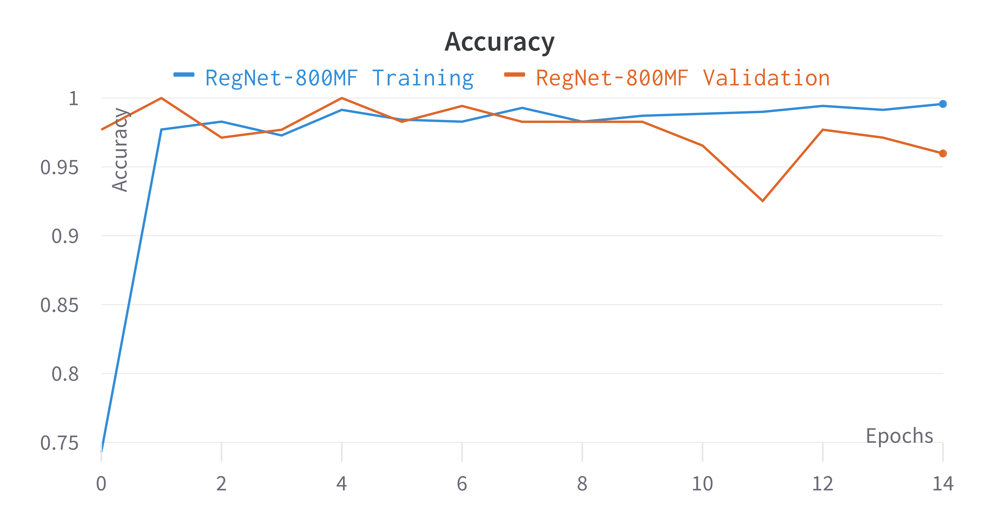
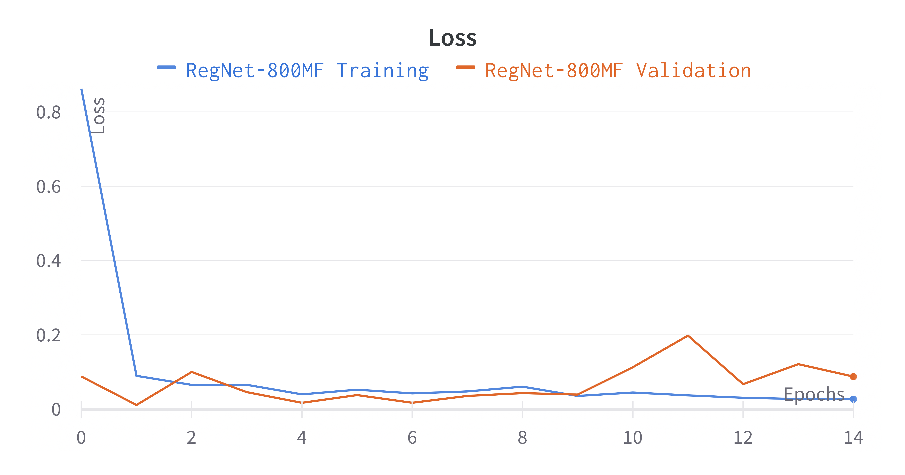

# Real time detection
The document contains the followinf subsections: 
- Data
- Model
- Inference

# Data 
The original dataset consists of folders with images of cars in no particular order, each folder consists of a JSON file with metadata of every image. The original dataset contains several images that are not useful for training the model for the specific use case. 

There is a severe imbalance in the number of samples for each class (Over 200 images for both Rear and Front. Fewer than 50 Images for Front-Left, Front-Right, Rear-Left, Rear-Right) this is handled by Data Augmentation both before and during runtime. 

The refined dataset is organized into separate folders containing the images corresponding to each class, i.e. Front, Rear, Front-Left, Front-Right, Rear-Left, and Rear-Right. 

To extend the dataset and decrease the imbalance in the data, the Front left, Front right, Rear Left, and Rear right classes were extended by splitting full side profile images from the original dataset, inverting them vertically and cropping the image horizontally (shown below)


The final dataset contains images after augmentation and removing bad samples (Images with objects in the background, or improper processing)

Dataset details: 
Class  | No. Original Samples| No. Final Samples (Train) 
------------- | ------------- | ------------- 
Front   | 250 | 184 
Front-Left | 14 | 109 
Front-Right  | 19 | 126 
Rear  | 220 | 183 
Rear-Left  | 17 | 113
Rear-right | 23 | 108

# Model 

## Model: RegNet
Sure, here's an optimized response:

RegNet is a convolutional neural network architecture proposed by Facebook AI Research in 2020. It is called "RegNet" because it uses network pruning to create a more efficient CNN. The network pruning technique removes unnecessary connections and filters from the network to improve its computational efficiency while maintaining its performance.

To create RegNet, the researchers started with a large pool of potential network architectures and evaluated them on a large image classification dataset. They then applied network pruning, architecture search, and regularization techniques to improve the efficiency and ease of training. The resulting family of RegNet architectures achieved state-of-the-art performance on various image classification benchmarks while requiring fewer computations than other CNN architectures.

RegNet is particularly suitable for resource-constrained environments such as mobile devices and embedded systems. Its efficiency and performance make it an attractive option for image classification tasks.

["Designing Network Design Spaces" by Ilija Radosavovic, Raj Prateek Kosaraju, Ross Girshick, Kaiming He, and Piotr Dollár, published at the IEEE Conference on Computer Vision and Pattern Recognition (CVPR) in 2020)](https://arxiv.org/abs/2003.13678)

[RegNet Benchmarks](https://github.com/facebookresearch/pycls/blob/main/docs/BENCHMARKS.md)

## Optimizer: Lion 
The Lion optimizer is a gradient descent optimization algorithm that aims to improve the stability and convergence speed of the training process for neural networks. It addresses some of the limitations of existing optimization algorithms by incorporating techniques such as adaptive gradient clipping, momentum correction, gradient normalization, and adaptive learning rate scheduling.

The core idea behind the Lion optimizer is to dynamically adjust the gradient clipping threshold based on the current state of the optimization process. This helps to avoid issues such as exploding or vanishing gradients, which can lead to slow convergence or even divergence.

Experimental results have demonstrated that the Lion optimizer can achieve state-of-the-art performance on various deep learning tasks, including image classification, language modeling, and generative modeling. Additionally, it has shown robustness to changes in hyperparameters and is relatively easy to implement and use. 

[Symbolic Discovery of Optimization Algorithms](https://arxiv.org/abs/2302.06675)

[Authors Implementation](https://github.com/google/automl/tree/master/lion)


## Hyperparameters: 

Hyperparameter  | Value
------------- | ------------- 
Model   | RegNet-800-MF (MF = Million Floating point operations)  
Training Metod   | Transfer Learning (ImageNet-1k Weights)  
Epochs   | 15  
Optimizer | Lion 
Learning rate | 1e-4 (10 Epochs) + 1e-5 (5 Epochs)
Loss Function  | Cross-entropy 
Batch Size  | 10 


## Training Results

Metric  | Value
------------- | ------------- 
Training Accuracy | 99.571
Training Loss   | 0.026
Validation Accuracy   | 95.977  
Validation Loss | 0.087




# Inference

To run inference using the above model, assuming the current working directory is Product_Overlay_Aditi_Shanmugam:
``` 
pip3 install -r ./Scripts/requirements.txt
python ./Scripts/test_predict.py -inference_model_path ./Model/RegNet-800MF-Lion.tflite -input_data_path <Test images folder> -output_csv_name ./Inference_Output.csv

```
creates the Output csv in the current working directory. 

The input image directory structure expected is :

```
Test_folder
│   Image1.jpg
│   Image2.jpg          
│       .
│       .
│       .         
│   ImageN.jpg
│--------------
 ```


 Aditi Shanmugam (aditishanmugam1@gmail.com)

